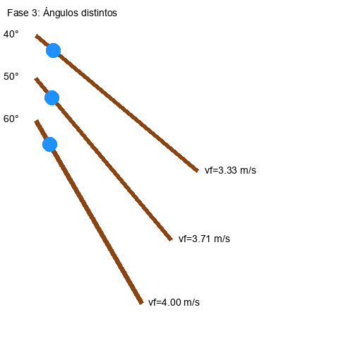

  

# Simulacion de friccion

Este experimento tuvo como objetivo explorar los factores que afectan el movimiento de un objeto sobre un plano inclinado. A partir de conceptos básicos de dinámica, se analizaron creencias comunes —como la influencia del área de contacto— frente a lo que predice el modelo físico: que la fricción depende de la fuerza normal y del coeficiente de fricción, pero no del área superficial.

Se utilizaron figuras con diferentes formas y superficies, y se variaron condiciones como el ángulo de inclinación y el tipo de material. Los resultados se analizaron tanto de forma experimental como con un modelo teórico para comparar comportamientos.

## Simulación
Se desarrollaron 4 simulaciones que replican distintas condiciones del experimento descritas en el informe técnico (ver archivo PROYECTO.pdf). Cada una permite visualizar cómo distintos factores afectan la velocidad final del objeto en la rampa.

### Fase 1 – Diferentes masas

    

 

En esta simulación se observa que, a pesar de tener masas distintas, los objetos alcanzan la misma velocidad final. Esto confirma que la masa no influye en la aceleración ni en la velocidad en ausencia de resistencia del aire.

### Fase 2 – Diferente área de contacto

    

 

Aquí se enfrentan cuerpos con igual masa pero diferente área de contacto. La simulación muestra que ambos se comportan igual, reforzando la idea de que la fricción no depende del área de apoyo.

### Fase 3 – Diferentes ángulos de inclinación

    

 

En esta simulación se observa cómo el ángulo afecta significativamente la velocidad. A mayor inclinación, mayor componente de la gravedad en la dirección del plano, y por tanto, mayor aceleración.

### Fase 4 – Diferentes superficies

    

 

Se utilizaron rampas con superficies de madera lisa, plástico y lija. Como era de esperarse, las superficies con mayor fricción reducen considerablemente la velocidad final del objeto.

| Estas simulaciones permiten visualizar de manera intuitiva lo que predicen los modelos físicos, facilitando así el entendimiento de conceptos clave como fricción, aceleración y dinámica en planos inclinados.
